<!-- MVB: This bloody rmarkdown process has gotten WAY too complicated.
YAML headers, HTML syntax (here), what bit of code is doing what? aaaargh
Good intentions, but people have tried to make it do TOO MUCH
and the proliferation of low-level details have obscured the high-level appeal.
and I am spending more time trying to get it to all work together than I am on writing the docu
and I worry that in 6 months' time when I revisit it, I will have forgetton how to make stuff work... (just verified; it's true :/)
And EG, how good is it that we need yet another comment marker; # // % not enough it seems
or someone suggests ~~~{=comment} ... ~~~ of course how clear
but that doesn't even work
and we are stuck with this mess
no doubt all it needs is another format, maybe add some json :/ 
("joke")
-->

<!--
The other big problem is that vignettes are an undebuggable horrorshow
FWIW I *did* have the 'debug' package working on vignettes at one point... but apparently no longer...
-->


Package `kinference` uses SNP genotypes to find pairs of closely-related kin within a set of biological samples, presumably for use in Close-Kin Mark-Recapture. In this vignette, we: 

1. demonstrate the core functions for kin-finding with a perfect dataset (section 1); 
1. clean up a 'typical' dataset to get it to work for kinfinding (section 2); 
3. and show _some_ warning signs of Things Going Wrong (section 3). 

Kinference can be pretty complicated, though it isn't always. We can't
show everything here; this is actually a subset of a much larger
evolving document, and we ourselves are still learning about the
process as we throw new datasets with new problems at the
software^[And sometimes the right solution is: get a better dataset,
or move to a different problem. Sad but true.]! There may be courses;
check with the package maintainer. If you have questions, first have a
look at the [Github Discussions
page](https://github.com/orgs/closekin/discussions) for `closekin`,
the parent Organisation of package `kinference`. Also, do look at
`?kinference` inside R, plus of course the detailed documention
of individual functions. This document makes reference in a few place to "the MS", a
long-awaited paper that gives details of all the algorithms used in
this package. Unfortunately, the MS doesn't quite exist at time of
writing, but it is coming...


# Section 1: kin-finding

Here, we step through kin-finding with a well-behaved, well-cleaned
dataset in `snpgeno` format. We will use the `dropbears` dataset
included with package `kinference`. Some standard checks should
_always_ be done, but the `dropbears` dataset is already clean and
won't require any changes, and the allele frequencies have already
been estimated. To see a dataset in need of cleaning (like yours!),
see **Section 2**.

A dataset for kinference should have all of its samples drawn from a
single, genetically-homogenous population, without any duplicate
samples, samples from another population (or species!), or
cross-contaminated or degraded samples. It also needs all loci to be
"well-behaved", ie in Hardy-Weinberg proportions, without substantial
allelic dropout^[However, heritable/repeatable null alleles are OK---
see 'gbasics' package. Nulls are inevitable for some species under
certain genotyping methods.] or genotyping errors, not duplicated, not
under (strong) selection, etc.

## A quick look at the dataset

<!-- Don't cache library() calls (I think)
And suppress startup messages
-->


``` r
library( mvbutils)     ## not sure if it needs to be explicitly loaded     
library( gbasics)      ## so data objects behave nicely
library( atease)       ## convenient access to attributes; x@thing
library( kinference)
```


``` r
kincol <- kinPalette() ## kin-specific colours, used later

## 'dropbears' is a dataset that comes with 'kinference'
## Very quick look at snpgeno data: covariates and some genotypes of a few samples
dim( dropbears)
```

```
## [1]  480 2000
```

``` r
dropbears[1:3, 1:5]
```

```
##                                                              l   l   l   l   l
##                                                              o   o   o   o   o
##                                                              c   c   c   c   c
##                                                              u   u   u   u   u
##                                                              s   s   s   s   s
##                                                              _   _   _   _   _
##   Our_sample Our_plate sex weight_kg    popn dropheight_m    1   2   3   4   5
## 1   sample_1         1   ?     113.0 Eastern            6   AB AAO AAO AAO  AB
## 2   sample_2         1   M     112.7 Central            4  AAO  AB  AB AAO  AB
## 3   sample_3         1   M      98.8 Eastern            5  AAO AAO AAO AAO  AB
```

``` r
## Boring but necessary data-prep:
dropbears <- kin_power(dropbears, k = 0.5)

plod_HU <- find_HSPs(dropbears, keep_thresh = 0)
histoPLOD( plod_HU, log=TRUE)
```


This plot shows observed log-densities of one kin-finding statistic
(there are several) across all pairs of animals in the `dropbears`
dataset, as the black stair-step lines. It also shows some vertical
lines at the the predicted means for various kinships based on allele
frequences, and the predicted distribution of unrelated pairs as a
smooth purple curve. This is an excellent-looking kin space with all
the bumps in all the right places - we'll definitely be able to find
kin pairs here.


## Finding and classifying kin pairs

From here, there are many potential workflows for finding kin
pairs. The workflows can depend on demographic information (e.g., one
might look for sibling pairs only among samples of young animals
caught at a similar time, to reduce confusion from other kinships that
are common in more general comparisons; or, first look for POPs only
among pairs with a sizeable birth-year gap). Here, we show one
potential workflow for kin-finding that does not use
covariate/demographic information. We're going to end up with four
categories of pairs:

 * POPs (Parent-Offspring Pairs)
 * FSPs (Full-Siblings Pairs): collectively, POPs and FSPs constitute "first-order" kin, or 1KPs
 * Definite 2KPs, (2nd-order Kin-Pairs, including Half-Siblings HSPs^[Because HSPs are usually much more important to CKMR than other 2KPs (and usually commoner), we sometimes slip into saying "HSPs" when "2KP" would be more correct, eg in the name of the function 'find_HSPs'. Sorry about that...], Grandparent-Grandchild GGPs,  and full-thiatic^["Thiatic" is a succinct bidirectional gender-neutral term that comprises aunt-niece, uncle-niece, aunt-nephew, and uncle-nephew kinships. "Half-thiatic" pair is when either the mother of one is the grandmother of the other, or father/grandfather, but not both.] FTPs), and 
 * "other", which includes 3KPs, 4KPs, etc, all "Unrelated" Pairs (UPs), plus a proportion of 2KPs that didn't look definite enough ("false negatives"). 

The technical complication is that the simple and robust kin-finding
statistics which we prefer, are all just for deciding just 2 kinships,
eg POP vs FSP, or 2KP VS UP. But here we have at least 4 possible
kinships overall. Thus the trick is to divide-and-conquer, splitting
the collection of kin-pairs first into coarse groups and into finer
ones. The workflow goes:

  * find provisional POPs, ie all true POPs but potentially some FSPs too;
  * within the provisional POPs, split definite POPs from FSPs;
  * find provisional non-POP kin, including FSPs, 2KPs, 3KPs, and maybe some 4KPs, but hopefully no UPs;
  * within those, split definite FSPs;
  * identify a subset of (almost) definite 2KPs, and estimate the false-negative rate for that set.

Let's begin.

## Find 'strong' kin pairs and split out POPs

We'll start by doing pairwise comparisons of all samples, calculating
a statistic designed to distinguish POPs from UPs or other types of
kin. [Actually, two different POP statistics are available in
'kinference' now: the newer one, which might become the recommended
option one after we've tested it more, is shown later, but we'll start
with the older one, which has been used in all our real-life CKMR
applications to date.] This (older) statistic is called "wpsex"
(weighted pseudo-exclusions: see MS) and takes values between 0 and 1:
close to 0 for POPs, and higher for UPs or other kin. First, let's get
a global overview of the situation:


``` r
# strongKin <- find_POPs(dropbears, limit_pairs=10000, keep_thresh=1)
strongKin <- find_POPs(dropbears,
   keep_thresh=0.1) # upper limit guess of "interesting" wpsex values in other studies
```

```
## Returning just the 240 pairs with most POP-like wpsex; increase 'limit_pairs' to get more
```

``` r
# ... can disregard that limit_pairs warning *for now*, since this is just an overview

## What summary stats are there?
names( attributes( strongKin)) # or atts( strongKin) thx2 'atease'
```

```
##  [1] "names"          "row.names"      "class"          "bins"          
##  [5] "n_wpsex_in_bin" "eta"            "keep_thresh"    "n_loci"        
##  [9] "mean_UP"        "var_UP"         "call"
```

``` r
## Overview plot for all pairs
with( attributes( strongKin), 
    plot( bins, n_wpsex_in_bin, type='s' ))
abline( v=strongKin@mean_UP, col=kincol['UP'])
```


``` r
## Not very informative, because the huge number of UPs masks the interesting stuff.
## Transform the y-scale...
## 0.25 power transform is a bit like log but copes with 0 (thanks: Bill Venables)
with( attributes( strongKin), 
    plot( bins, n_wpsex_in_bin^0.25,
    type='s'))
abline( v=strongKin@mean_UP, col=kincol['UP']) # theoretical mean
```


``` r
## Zoom in on interesting region. First, re-run to make sure we get _all_ 
## the kin-pairs in that region, with no limit_pairs warning
strongKin <- find_POPs(dropbears,
   limit_pairs= 10000, # clearly less of them than that
   keep_thresh=0.07) # upper limit guess of "interesting" wpsex values in other studies

## ... and plot it again
with( attributes( strongKin), 
    plot( bins, n_wpsex_in_bin^0.25,
    type='s'))
abline( v=strongKin@mean_UP, col=kincol['UP']) # theoretical mean
```


<!--
Shane's version:
# strongKin <- find_POPs(dropbears, limit_pairs=choose(nrow(dataset), keep_thresh = 1)
## As a demonstration, I've set limit_pairs and keep_thresh to keep
## every pair - setting limit_pairs to _n_ and keep_thresh to 1 (an
## arbitrary very high value - you can see in the figure below that
## nearly all pairs have a wpsex < 0.10) will return only the _n_ most
## POP-like pairs. Keeping the results of all pairs isn't informative, and
## we recommend against choose(nrow(dataset), 2) anyway for
## large datasets because the resulting object may not fit into RAM -
## but dropbears is a small dataset, so this is OK.
hist(strongKin$wpsex, breaks = 50)
lines(strongKin@bins,diff(c(0,pnorm(strongKin@bins, mean = strongKin@mean_UP,
                    sd = sqrt(strongKin@var_UP)) * choose(nrow(dropbears), 2))),
      lwd = 2, col = kincol['UP']) 
## The curved line gives predicted distribution for Unrelated Pairs.

The `wpsex` statistic calculated by `find_POPs` has an expectation of
zero for true POPs with no genotyping error, and we
see a spike of about 20 pairs near zero, and a few more bumps of kin
pairs, which will be FSPs, HSPs, and so on. Let's
keep all pairs with `wpsex < 0.055` as our first set of 'strong' kin
pairs, and start separating them out.
-->


And we can clearly see a big bump of UPs on the right, a spike of
about 20 pairs near zero, and in-between a few more bumps which will
comprise FSPs, HSPs, and so on. The UP bump isn't _quite_ centred
where purple theory says it should be^[We're not sure exactly why not,
but it's possibly related to using estimated allele frequencies rather
than true. For this dataset, null alleles happen to be non-existent (a
consequence of the genotyping method :) but maximum-likelihood
estimates of null frequency can of course slightly exceed 0 by chance,
and here they do so for about 25% of the loci.], but it's close
enough; let's keep going. Based on those plots, we now pick some
reasonable threshold of "interesting", and then select all pairs below
that threshold:


``` r
## Select threshold for "worth investigating further". By eye.
UPcut <- 0.055
      
## Focus on those pairs:
strongest <- strongKin %where% (wpsex < UPcut)
# same as: strongest <- strongKin[ strongKin$wpsex < UPcut,]
dim( strongest)
```

```
## [1] 96  4
```

``` r
## Show just top 5 then bottom 5 of these, for space:
head( strongest, 5)
```

```
##   wpsex   i   j nABOO
## 1     0 480 479     0
## 2     0 442 441     0
## 3     0 458 457     0
## 4     0 470 469     0
## 5     0 444 443     0
```

``` r
tail( strongest, 5)
```

```
##         wpsex   i   j nABOO
## 92 0.05321924 372 371     0
## 93 0.05418923 296 295     0
## 94 0.05478924 224 223     0
## 95 0.05494807 210 209     0
## 96 0.05498616 316 315     0
```

Now we'll calculate a statistic designed to separate POPs from
FSPs^[There might also be some 2KPs within `strongest`, but in terms
of this statistic they will look more like FSPs than like POPs. We
only want "POPs vs rest" for now, so we can deal with "rest"
later.]. Note that we do have to specify a genotyping error rate
(`gerr`) here--- but the calculation is quite robust to
mis-specification, so don't worry. In _our_ datasets, it's been below
0.01 (1%), but _yours_ might be different, of course. If your error
rate is much higher than that, you probably won't be able to use your
dataset for kin-finding anyway.


``` r
splitPOPs <- split_FSPs_from_POPs( dropbears, strongest, gerr= 0.01)

hist( splitPOPs$PLOD_FP, breaks= 50, main= "", xlab= "PLOD_FP")
## Colours: kincol was set by call to kinPalette()
abline(v = splitPOPs@E_FSP, col = kincol['FSP'], lwd = 2) 
abline(v = splitPOPs@E_POP, col = kincol['POP'], lwd = 2)
legend("topright", legend = c("POP expectation", "FSP expectation"), 
    lty = c(1,1), lwd = c(2,2),
    col = kincol[ c('POP', 'FSP')], bg = "white")
```

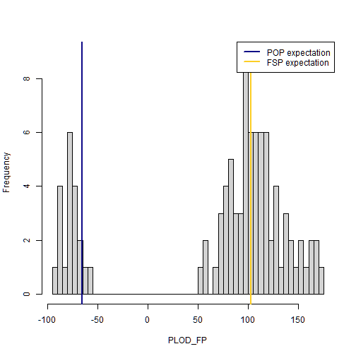

``` r
## Clump in [-50,-100] are POPs; 
## rest a mix of FSPs, HSPs, and possibly weaker kin.

POPs <- splitPOPs[splitPOPs$PLOD_FP < 0,] ## our first set of definite kin pairs
POPs$ij <- paste(POPs$i, POPs$j) ## a pair ID
```

We now have a set of definite POPs; next we need to find FSPs and 2KPs.


## Find definite FSPs

We can't go straight from the POP results in `strongest` because the
FSPs may not all be in `strongest` (their "wpsex" score may not have
fallen below that `UPcut` threshold in the first place). So we start
by provisionally identifying "all interesting kin" (1KPs and 2KPs, but
perhaps with some 3KPs etc mixed in), taking out the POPs that we
already have, and then separating the remainder into FSPs vs "the
rest". The tool for the job is `find_HSPs`, which we already used for
a quick overview of all kinships. This time we should be a bit more
careful with the arguments because we want to select specific pairs,
so here's some detail.

`find_HSPs`--- which should really be called `find_2KPs`--- keeps
binned counts of PLODs for all pairwise comparisons, but only keeps
individual PLODs for those pairs whose PLOD is above `keep_thresh`,
which we will need to set^[The logic here is that the overwhelming
majority of pairs will be unrelated, and keeping scores for each of
them can easily overflow RAM with useless "information". For the UPs,
we only need to check whether the PLOD distribution is consistent with
theory, so binned counts are fine.] Before calling `find_HSPs`, we can
find the expected PLOD for an UP, which will be negative. It so
happens that the expected PLOD for an 2KP is roughly the absolute
value of the UP mean, and for a 3KP the expected PLOD is close
to 0. If kinference is going to work, the 2KP bump should be well to
the right of the 3KP mean, so choosing `keep_thresh` just below 0 (ie
at a small proportion of the UP mean) should keep the interesting
stuff without too much rubbish. It's also a good idea to set
`limit_pairs` argument, so that the computer doesn't try to retain
zillions of actually-unimportant kin in case we set `keep_thresh` too
low; 10000 should be fine. With all that in mind, here we go:


``` r
## find HSPs-or-stronger using find_HSPs

## Expected PLOD for UPs (thanks to 'kin_power' earlier):
sum( dropbears$locinfo$E_UP)
```

```
## [1] -64.46572
```

``` r
## So "-10" should be OK for keep.thresh here. Guard against keeping too many:

HSPs_1 <- find_HSPs(dropbears, keep_thresh = -10, limit_pairs=10000)

## plot the counts of PLODs in bins, on a log_10 scale so we can actually see the bumps:
histoPLOD( HSPs_1, log=TRUE)
```


Note the general pattern - there is a large bump of UPs, with mean and
variance exactly where theory predicts them to be, and bumps for 2KPs
and 1KPs (ie, FSP as well as POP) centred exactly where theory
expects^[Recall that POP stats were slightly off. However, 2KP _stats_
seem a bit more robust, even though 2KPs themselves are harder to
identify. So if these HSP/2KP stats _aren't_ very well aligned in your
data, be nervous.]. There's also a "shoulder" around 0, between the UP
and 2KP bumps, which is just where we'd expect 3KPs to be. This is a
good dataset.

Now we can zoom in on just the individually-kept PLODs for the
retained pairs. We want an unlogged plot, so we must set `lb` to be
the lower bound on displayed PLODs (to exclude the huge bump). The
unlogged version shows actual retained PLODs, not bin-counts, so
there's no point in setting `lb` below the previous `keep_thresh`. We
also need to set `fullsib_cut` by eye, anywhere in the air-gap that is
hopefully between 1KPs and 2KPs (it's not vitally important where; see
'?histoPLOD' for more).


``` r
# 'bin' sets bin width for histo
histoPLOD( HSPs_1, log=FALSE, fullsib_cut = 120, lb = -10, bin = 10)
```


<!--
## This is an unlogged version of the previous, zoomed
## in to the region where we expect to find kin pairs. We will soon
## see a very closely-related plot generated by autopick_threshold,
## that takes the same datapoints and helps in drawing a cutoff
## between the different types of kin pairs shown in the histoPLOD.

## Also note that `lb` is set to the same value as `keep_thresh` in
## find_HSPs, because we didn't keep any individually-stored PLODs
## below that to plot. `fullsib_cut` is set by eyeballing the
## histoPLOD for an air-gap between halfsibling and fullsibling
## pairs.
-->

The PLOD in `find_HSPs` doesn't itself discriminate well between FSPs
and POPs, but there is a clear gap between 1KPs and 2KPs. Any 1KPS
that _aren't_ POPs must be FSPs, so we can pick all 1KPs using this
PLOD, subset out the POPs that we already found, and be left with the
FSPs.


``` r
POPsOrFSPs <- HSPs_1[HSPs_1$PLOD > 110,]           ## anywhere in the valley
POPsOrFSPs$ij <- paste(POPsOrFSPs$i, POPsOrFSPs$j) ## pair ID to match the one in POPs
FSPs <- POPsOrFSPs[!POPsOrFSPs$ij %in% POPs$ij,]   ## find our FSPs
```

Now, we have our set of POPs, our set of FSPs, and a set of tentative
2KPs. Again, those "second-order kin" comprise half-sibling,
grandparent-grandchild, and full-thiatic pairs: we cannot split
between those genetically^[Well, it is theoretically possible to
improve somewhat on a blind guess, but you need high-resolution
genomic data.], but in many CKMR applications, covariate data such as
ages can do the job. In this particular case, the 2KPs will almost all be HSPs, on demographic grounds (details out of scope here). However,
the bigger issue is that the set of tentative 2KPs may well be
contaminated by more-distant kin, mainly 3KP (half-thiatic and
great-grandparent-grandchild pairs) and 4KP (e.g. half-first-cousin
pairs). We have already gotten rid of the 1KPs, but for the rest we
now need to decide on a PLOD cutoff above which we will treat
everything as "definite 2KP". We will then use the distribution
of PLODs among those "definite 2KPs" to work out how many
false-negative 2KPs are likely to have fallen below the cutoff. Unlike
with 1KPs vs 2KPs, there won't be a clean break, so things get a bit
more complicated.

The idea of choosing the cutoff is to let us retain a (hopefully large) proportion of true 2KPs, subject to a tolerance on the expected number of contaminating 3KPs and 4KPs that by chance fall above the threshold. That tolerance is up to you; you really don't want many false-positives from 3KPs because they can mess up a CK model. The problem isn't the _number_ of false-positives; rather, it's the different dynamics that different kinships have. Most of all, 3KPs tend to have much longer birth-gaps than HSPs, so that mislabelling even a couple of 3KPs as "HSPs" can cause a substantial bias in mortality-rate estimates. (Note that it doesn't cause bias to discard some true 2KPs below the cutoff, because we can compensate by incorporating the estimated false-negative rate directly into the CKMR model.) While it's a good idea to choose a high cutoff for that reason, there is a trade-off; higher cutoffs do lead to fewer definite 2KPs going into the model, and thus to higher variances, as well as making it harder to check model diagnostics. Nevertheless, you should certainly go high enough to get your estimated false-positive rate well _below_ the false-negative rate; you defintely _don't_ want "equal probabilities" here.

We have often chosen the cutoff at a round number by eye, but a more systematic approach is via the `autopick_threshold` function. This takes the empirical distribution of PLODs in the tentative 2KPs, estimates the impact of linkage, and--- on the assumption that each comes from either a 2KP, 3KP, or 4KP--- fits a constrained mixture decomposition (see function documentation and MS for details) to estimate the underlying distributions and numbers of 2KPs/3KPs/4KPs, before numerically choosing a cutoff to achieve the desired tolerance. When `autopick_threshold` works well, it's great; but don't trust its output if it doesn't look sensible, because it may have too much flexibility in fitting especially when the number of kin-pairs is low. Whether-or-not you use `autopick_threshold`, the process _is_ intrinsically subjective, because _you_ have to decide how many 3KPs you are willing to tolerate. So, picking a cutoff by eye is also OK (because the false-negative rate computed afterwards will eliminate bias), as long as you don't try to "tweak" the cutoff to include/exclude specific pairs.


``` r
HSPs_1$ij <- paste(HSPs_1$i, HSPs_1$j)
HSPs_2 <- HSPs_1[!HSPs_1$ij %in% c(POPs$ij, FSPs$ij),] 
## plot the empirical PLODs with the expected distribution
## of the PLOD for half-sibling pairs
thresh <- autopick_threshold( dropbears, kin = HSPs_2, fitrange_PLOD = c(0, 110),
    FPtol_pairs = 1, # tolerate 1 expected false-positive 
    use4th = TRUE, selecto = "ML", plot_bins = 5)
```


``` r
thresh    
```

```
## [1] 26.95019
## attr(,"fitrange_PLOD")
## [1]   0 110
## attr(,"selecto")
## [1] "ML"
## attr(,"use4th")
## [1] TRUE
## attr(,"FPtol_pairs")
## [1] 1
## attr(,"info")
##        V0_M3        Vx_M3        V0_M4        Vx_M4         V_UP        V_HSP 
## 179.73173469 192.16732957 162.50489075 166.41104623 135.87646860 185.98068796 
##        C_hat      rho_hat           E2           E3           E4          SD2 
## 211.29912111   0.05290546  61.59919050  -1.43326485 -32.94949252  13.63747366 
##          SD3          SD4           P2           P3           P4           N3 
##  13.86244313  12.90004055   0.14358149   0.13851105   0.71790746  49.25105851 
##         Nall       thresh      Pr_FNeg 
## 355.57494499  26.95019383   0.00553123
```

Well, that plot looks great! With that cutoff, we can select our "definite 2KPs" and the estimated false-positive and false-negative rates of that set:


``` r
HSPs <- HSPs_2[HSPs_2$PLOD > thresh,]
fpos_rate <- thresh@FPtol_pairs / nrow(HSPs) ## ~2% of our 'HSPs' are false-positives
fneg_rate <- thresh@info["Pr_FNeg"]
## we're missing about 0.5% of HSPs to false-negatives; 
## _extremely_ good, expect 10--20% yourself!
nrow(HSPs) ## 52 inferred likely half-sibling pairs
```

```
## [1] 52
```

## Examine covariates of kin-pairs data

It's almost always useful to look at the covariates of the kin-pairs,
which typically have a different distribution to the covariates of
typical samples. Those covariates are essential for subsequent CKMR
models.


``` r
summary( dropbears$info[ c( HSPs$i, HSPs$j), ]) ## samples in HSPs
```

```
##   Our_sample          Our_plate     sex              weight_kg     
##  Length:104         Min.   :1   Length:104         Min.   : 23.30  
##  Class :character   1st Qu.:1   Class :character   1st Qu.: 88.35  
##  Mode  :character   Median :1   Mode  :character   Median :109.75  
##                     Mean   :1                      Mean   :101.98  
##                     3rd Qu.:1                      3rd Qu.:119.03  
##                     Max.   :1                      Max.   :144.90  
##      popn            dropheight_m   
##  Length:104         Min.   : 0.000  
##  Class :character   1st Qu.: 2.750  
##  Mode  :character   Median : 3.000  
##                     Mean   : 3.538  
##                     3rd Qu.: 4.000  
##                     Max.   :10.000
```

``` r
summary( dropbears$info)              ## all samples
```

```
##   Our_sample          Our_plate     sex              weight_kg    
##  Length:480         Min.   :1   Length:480         Min.   : 10.2  
##  Class :character   1st Qu.:1   Class :character   1st Qu.: 86.7  
##  Mode  :character   Median :1   Mode  :character   Median :108.2  
##                     Mean   :1                      Mean   :100.7  
##                     3rd Qu.:1                      3rd Qu.:117.3  
##                     Max.   :1                      Max.   :144.9  
##      popn            dropheight_m   
##  Length:480         Min.   : 0.000  
##  Class :character   1st Qu.: 2.000  
##  Mode  :character   Median : 3.000  
##                     Mean   : 3.513  
##                     3rd Qu.: 5.000  
##                     Max.   :10.000
```

## Alternative POP statistic

Incidentally, here's the newer POP statistic in action. You need to
specify some genotyping error rate, as with `split_FSPs_from_POPs`,
but again any reasonable choice should lead to the same final set of
POPs.


``` r
## Assume modest error rate
sk1 <- find_POPs_lglk( dropbears, gerr= 0.01, limit_pairs= 200, keep_thresh= -5)
histoPLOD( sk1, log=TRUE)
```


``` r
histoPLOD( sk1, log=FALSE, lb=-5)
```

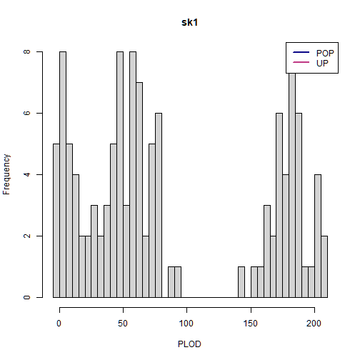

``` r
## Assume bad error rate
sk5 <- find_POPs_lglk( dropbears, gerr= 0.05, limit_pairs= 200, keep_thresh= -5)
histoPLOD( sk5, log=TRUE)
```


<!--
comment syntax is insane :/
MVB zapped this: get_pair_covars() is not needed (as agreed) since find_HSPs() actually _does_ now record correct sample rows.
Also, we should probably demo the rowid_field stuff (safer than row-numbers, eg in case of subsequent subsetting). But not right now...

Now, we have three sets of kin pairs, but they're not linked to sample
covariate data like an individual ID - individuals are identified by
their row numbers in the dataset used for analysis, but for any
subsequent analysis, some additional sample information will almost
certainly be useful. Let's associate the pairs with their sample
covariates.

Commenting out the code doesn't exclude it, at least not from tangling, so manually added eval & include equals false  I do not like this
-->
	
# Section 2: cleaning the bluefin dataset

Your data will almost certainly need cleaning before you can do the
kin-finding in Section One. To show how (and, in **Section 3**, _why_),
we'll use the `bluefin` dataset included in package `kinference`.

## Population allele frequencies

Many of the functions in `kinference` require a `snpgeno` with
pre-computed population allele frequencies for each locus, stored in
an object called `pbonzer`. The `bluefin` dataset has its allele
frequencies pre-computed based on a larger version of the dataset, so
we won't recompute them, but here's how to do it:


``` r
# 'bluefin' is a dataset that comes with 'kinference'
# Check genotype encoding:
diplos( bluefin)  # aha, 6-way genotyping (legacy CSIRO data)
```

```
## [1] "AA" "AB" "AO" "BB" "BO" "OO"
```

``` r
## if you're using 4-way genotypes(most likely)
## bluefin <- est_ALF_ABO_quick( bluefin)

## if your data are stored 6-way:
## ('bluefin' is 6-way, but 'dropbears' is 4-way)
## bluefin <- est_ALF_6way( bluefin) # needs extra info too
```

Some loci may have an estimated A or B allele frequency of zero, which
can cause problems. It is best to drop loci with very low estimated A
or B allele frequencies - they wouldn't be very informative anyway.


``` r
bluefin <- bluefin[ , bluefin$locinfo$pbonzer[ ,"A"] > 1e-6]
bluefin <- bluefin[ , bluefin$locinfo$pbonzer[ ,"B"] > 1e-6]
```

## Checking for badly-behaved loci

The `bluefin` dataset, after these tweaks, has 1627 loci. The function
`check6and4` compares observed genotype frequencies for each locus to
the expected frequencies under Hardy-Weinberg Equilibrium, giving a
P-value for each locus. In an abstract perfect dataset, we would
expect their P-values to be uniformly distributed over the interval
[0,1] - so we would _expect_ about 0.151 of them to have a P-value
less than 1e-4. In practice, they have _always_ looked "worse than
expected" on real data, but often this has not mattered
downstream. The P-values are more to be taken as _relative_ measures
of well-behavedness here.


``` r
pvals <- check6and4(bluefin, thresh_pchisq_6and4 = c(1e-4, 1e-6), show6 = FALSE)
```

```
## genotypes are stored 6-way. Doing both 6-way and 4-way GOF tests...
```

```
## calculating both 6-way and 4-way pvals, plotting 4-way...
```


Those 'thresh...' values are entirely subjective, and dataset-dependent. They just control which points get coloured, so you can experiment til you find a threshold that excludes the loci you feel are visually unacceptable. (The real "proof of the pudding" comes much later, when you check whether 'find_HSPs' is looking OK. You should expect that this whole QC process will need to be iterative!)

We can see that most loci in this dataset lie pretty close to the
"observed = expected" line for all four genotypes - but some of them
are off the mark. In real datasets, it is wise to have a little
wriggle-room: this dataset may still contain duplicate samples, fish
from another population, or contaminated or degraded samples - and
each of those can contribute to the _loci_ having lower-than-expected
P-values. However, some of these loci are just abysmal - bad fish will
make all loci look bad, but they generally won't make a few particular
loci look _really bad_. The abysmal-looking loci almost certainly
aren't the result of a few bad fish. So for now, we will just remove
loci with P < 1e-10. After the rest of the cleaning stages, we can
(and will!) revisit these P-values without the bad samples.


``` r
bluefin_1 <- bluefin[, pvals$pval4 > 1e-10]
pvals_1 <- check6and4(bluefin_1, thresh_pchisq_6and4 = c(1e-4, 1e-6), show6 = FALSE)
```

```
## genotypes are stored 6-way. Doing both 6-way and 4-way GOF tests...
```

```
## calculating both 6-way and 4-way pvals, plotting 4-way...
```


``` r
## pvals_1 is storage so we can check back on the same scores later
```

## Finding and removing duplicate samples

Now, let's check for duplicate samples


``` r
## look for duplicates, noting any pairs with <50 different genotypes:
dups <- find_duplicates(bluefin_1, max_diff_loci = 50)
```

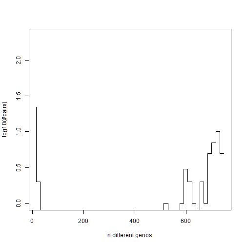

``` r
nrow(dups) ## 24 pairs of animals with fewer than 50 different genotypes
```

```
## [1] 24
```

We've got 24 pairs of animals with fewer than 50 different genotypes -
but nearly all of our animal pairs have more than 500 different
genotypes, and there's a huge air-gap between 40 and 500 with no
animal pairs. The 24 pairs with less than 50 different genotypes are
almost certainly duplicates. (On your own dataset, you should of
course check covariates at this point to confirm.) Anyway, quite often
"duplicates" actually turn out to be triplicates etc, but 'kinference'
only records pairwise results. When we have duplicates or triplicates
or whatever, we only need to keep one from each set. `kinference`
contains a convenient function - `drop_dups_pairwise_equiv` - to help
us do exactly that:


``` r
bluefin_2 <- bluefin_1[ -c( drop_dups_pairwise_equiv( dups[,2:3])),]
```

## Samples from another population or species

Now, we need to find and remove any outlying "animals not like the
others". These may be animals from another species or population that
have somehow made it into our dataset, or they might be badly degraded
or contaminated, or something might have gone wrong with extraction or
sequencing for that sample, or so on and so forth. Animals that don't
look like they're drawn from the same population as everyone else
aren't usable for kinference, at least not with this software.


``` r
ilglk <- ilglk_geno(bluefin_2)
abline(v = -1525) ## put our cutoff here
```

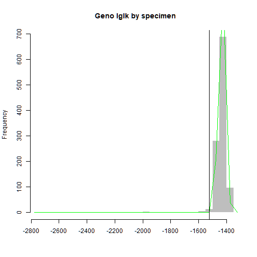

This pattern of `ilglk_geno` scores is pretty typical when most
samples are correctly identified, but there are a handful of animals
from a distantly-related stock or another species in the dataset:
there is a large, approximately Normally-distributed, spike at the
right-hand side of the plot, and a long tail strung out to the left,
containing the animals from another stock or species. In our case, any
animal with an ilglk score less than -1525 or so is not believable as
a member of the same stock as the main spike. Let's remove them.


``` r
bluefin_3 <- bluefin_2[ilglk > -1525,]
## now, does it look any better?
ilglk <- ilglk_geno(bluefin_3)
```

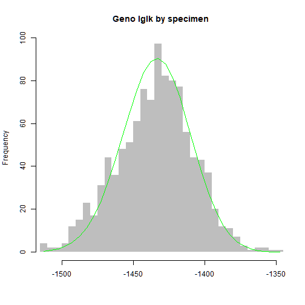

``` r
## Yes! Now re-do that important but boring internal calculation
bluefin_3 <- kin_power(bluefin_3, k = 0.5) 
```


## Cross-contaminated and degraded samples

Now, we need to _try_ to find and remove cross-contaminated or degraded samples. Checking for excess or deficiency of heterozygosity is the way to go here, but there some subtle details to do with null alleles and so on; see MS^[Which doesn't exist _yet_...]. The function for this is `hetzminoo_fancy`, which has a "rich" variant optimized for finding contamination, and a "poor" variant for degradation. With "rich", you're looking for too-big values; with "poor", for too-small values--- although it must be said that the two variants tend to look pretty similar.


``` r
hetzpoor <- hetzminoo_fancy(bluefin_3, "poor") ## ... maybe a couple of outlying low samples 
```

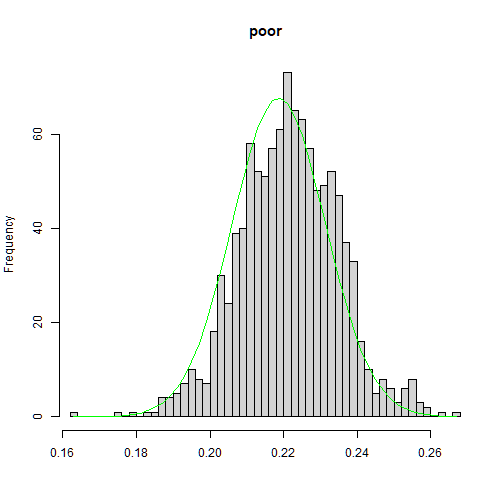

``` r
hetzrich <- hetzminoo_fancy(bluefin_3, "rich") ## ... maybe no high ones (debatable!)
```

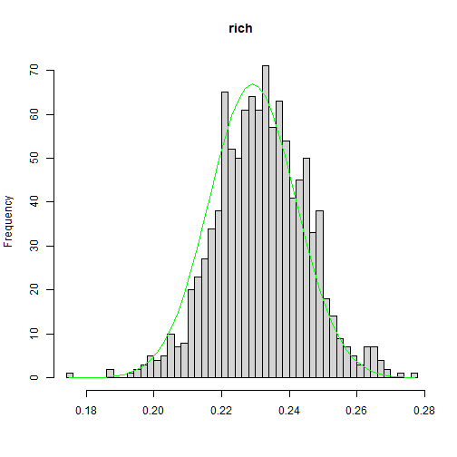

``` r
bluefin_4 <- bluefin_3[hetzpoor > 0.17,] ## remove the outlying low hetzpoor scores
hetzpoor <- hetzminoo_fancy(bluefin_4, "poor") ## Hey, the hetzpoor outliers are gone!
```

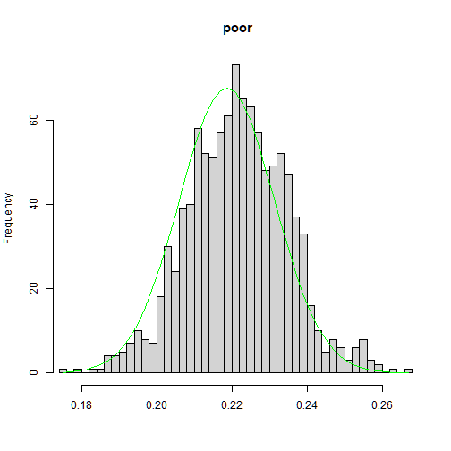

That was actually pretty good data (after initial cleanups)--- the heterozygosity outliers weren't particularly drastic and there weren't many. We could have gone a bit safer by trimming a few more "outliers", but let's keep going with what we now have.


## How has removing bad fish impacted our apparent locus quality?

Remember how I mentioned that having bad _samples_ in the dataset can
make _loci_ look bad? Let's take a look at the P-values for individual
loci we stored earlier, re-calculate them now that we've removed all
the bad fish, and see whether the loci look any better.


``` r
pvals_2 <- check6and4(bluefin_4, thresh_pchisq_6and4 = c(1e-4, 1e-6), show6 = FALSE)
```

```
## genotypes are stored 6-way. Doing both 6-way and 4-way GOF tests...
```

```
## calculating both 6-way and 4-way pvals, plotting 4-way...
```


``` r
lociPvals <- data.frame(
    pvals = c(pvals_2$pval4, pvals_1$pval4),
    stage = c( 
        rep("after", length(pvals_2$pval4)),
        rep("before", length(pvals_1$pval4)))
  )
lm1 <- lm(pvals ~ stage, data = lociPvals)
summary(lm1)
```

```
## 
## Call:
## lm(formula = pvals ~ stage, data = lociPvals)
## 
## Residuals:
##      Min       1Q   Median       3Q      Max 
## -0.11292 -0.10324 -0.07165  0.04540  0.81516 
## 
## Coefficients:
##              Estimate Std. Error t value Pr(>|t|)    
## (Intercept)  0.112922   0.004010  28.160   <2e-16 ***
## stagebefore -0.007792   0.005671  -1.374     0.17    
## ---
## Signif. codes:  0 '***' 0.001 '**' 0.01 '*' 0.05 '.' 0.1 ' ' 1
## 
## Residual standard error: 0.1549 on 2984 degrees of freedom
## Multiple R-squared:  0.0006323,	Adjusted R-squared:  0.0002974 
## F-statistic: 1.888 on 1 and 2984 DF,  p-value: 0.1695
```

Removing bad fish has caused a small improvement in the apparent
quality of our loci: the average locus in our dataset has seen its
P-value increase by 0.008. This is why we didn't want to be _too_
harsh in trimming loci early in our cleaning pathway - we would have
removed loci that were actually fine, but looked bad because of the
bad fish, and that would have cost us power by reducing the number of
good loci we use for kin-finding. If you _really_ want to refine your
locus-selection to keep as many as possible, you might try a _very_
lenient cutoff for locus quality, then look for very bad samples, then
tighten the locus quality cutoff, then look for bad samples again.

Another approach is to be _very_ stringent initially with both loci
_and_ samples, then progressively re-check whether some loci and some
samples can be re-admitted to the "good club". Wait for the book!


## Kinfer the bluefin dataset

The `bluefin` dataset is now cleaned. We won't go through the full
kin-finding routine again here - it would be the same as for
`dropbears` (see **Section One**). I'll just show you the "histoPLOD", so you
can see that kin-finding would now work for `bluefin`, cleaned as it is.


``` r
## As outlined in Section 1, `keep_thresh` sets a PLOD limit to
## prevent storing umpteen-millions of PLODs. Negative 10 i	s a often
## about right, but you may need to set it lower (to store more PLODs)
## or higher (to save RAM or make histoPLODs prettier)
HSPs <- find_HSPs(bluefin_4, keep_thresh = -10)
histoPLOD( HSPs, log=TRUE)
```


This histoPLOD shows a spike of unrelated pairs that is
well-characterised by its expected distribution, a spike in density
where we would expect to see half-siblings, and another spike in
density where we would expect FSPs or POPs. From this, it should be
clear that we can kinfer this dataset using the same approach as in
Section One, albeit with slightly less power.


# Section Three: do we _really_ need to do all that cleaning?


In this section, we demonstrate a handful of things that can go wrong
in a kinference analysis, and suggest ways to deal with them. This set
of examples is not exhaustive! If you have a problem that is not dealt
with in this section, you can try getting in touch with experienced 
kinferencers, including the maintainer of package `kinference`, at the 
[Github Discussions
page](https://github.com/orgs/closekin/discussions) 
for `closekin`, the parent Organisation of package `kinference`.

Offscreen, I've prepared versions of the `bluefin` dataset with
all-but-one of the cleaning steps. For example, `bluefin_exceptIlglk`
has had its loci checked, has had duplicates removed, had its
contaminated and degraded samples removed - but I've kept all the
samples that failed our check for animals from another population,
using `ilglk_geno`. I've also built `bluefin_exceptDuplicates`,
`bluefin_exceptHetzPoor`, `bluefin_exceptHetzRich`, and
`bluefin_except6and4`, each of which has skipped the obvious cleaning
step.  Here, we'll walk through the sorts of things you might see if
your data aren't properly cleaned.

## Duplicates

_In principle_, there are two reasons we don't want duplicate samples
in our kin-finding dataset: first, because our null distributions for
our various kin-finding statistics are calculated under the assumption
that each sample is drawn independently and at random from the sampled
population. Duplicate samples, especially if they account for a large
proportion of the dataset, will make those null distributions and
decisions based on them inaccurate. Second, if you follow the
kin-finding pathway shown in this vignette, and have duplicate samples
in your dataset, and don't check your results carefully, those dups
will be mistaken for POPs.

Duplicate pairs are very easy to spot: they look more closely related
than any true kin pair, so they appear far off to the right of the
histoPLODs (they might not be visible on the unlogged version though,
because it sets its xlim internally and will cut off massive
outliers). The `bluefin` dataset doesn't have all that many
duplicates, so the differences to the null distributions aren't
pronounced.


``` r
dupHSPs <- find_HSPs(bluefin_exceptDups, keep_thresh = -10)
## histoPLOD( dupHSPs, log=TRUE) # use the logged version to pick the fullsib_cut
histoPLOD( dupHSPs, log=FALSE, lb = 20, fullsib_cut = 150)
```

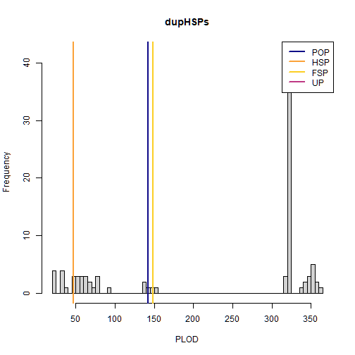


## Samples from another population or species

Samples from another population or species will look very unlike the
bulk of the other samples, so pairs with one animal from population A
(the intended population) and another from population B (the
unintended population) will tend to have very un-kin-like kinship
scores. On the other hand, pairs between two samples from population B
_may_ have very high kinship scores, especially if some loci have
alleles that are rare in population A but more common (or even fixed)
in population B.


``` r
# par(mfrow = c(2,1))
ilglkHSPs <- find_HSPs(bluefin_exceptIlglks, keep_thresh = -10, minbin = -150)
## there are a bunch of 'less related than expected' fish in the low tail
## of the unrelated pair bump.
histoPLOD( ilglkHSPs, log=TRUE)
```


Note both the bump out to the left of the unrelated pairs. There may
also be additional pairs scattered throughout the 'kin-like' regions
of the PLOD distribution (although it's not particularly apparent in
this dataset), but these pairs in the 'kin-like- regions will not
closely match the expected peak locations for any particular kin group
except by accident.


## Contaminated or degraded samples

A few contaminated or degraded samples in a mostly-clean dataset
behave very similarly to samples from another population or species:
when paired with unrelated clean samples, they will look dissimilar,
but when paired with each other, they can look very much like kin
pairs.

The `bluefin` dataset does not have many cross-contaminated or
degraded samples, so offscreen, I have added in some
cross-contaminated samples by taking random pairs of samples and
randomly 'contaminating' the first sample with alleles present in the
second sample with a probability that varies by sample. I've then
removed the original samples and mixed the 'contaminated' samples back
in with the `bluefin` dataset, generating a dataset called
`ctm_bluefin`.


<!--
Shane's original version below (after microtweaks by MVB). Didn't work with newer gbasics (but manual construction of snpgeno should be discouraged anyway ;)
I have had to add eval=FALSE because just commenting out the block does not prevent it from being tangled :/
-->


In Section 2, I showed that bad samples make loci look worse. Because
`ctm_bluefin` has many more bad samples than `bluefin`, we will have
to re-do the cleaning steps, starting from the locus cleaning. I'll
show kin-finding outputs on a version with its contaminated samples
left in, then show contamination cleaning, and finally kin-finding
outputs on the cleaned dataset.


``` r
pvals_ctm <- check6and4(ctm_bluefin, thresh_pchisq_6and4 = c(1e-4, 1e-6), show6 = FALSE)
```

```
## genotypes are stored 6-way. Doing both 6-way and 4-way GOF tests...
```

```
## calculating both 6-way and 4-way pvals, plotting 4-way...
```

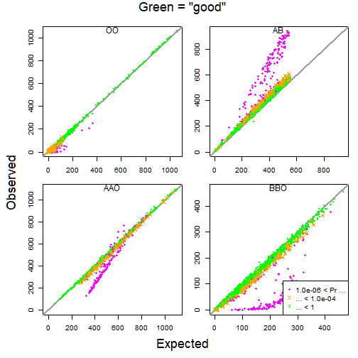

``` r
pvals_clean <- check6and4(bluefin, thresh_pchisq_6and4 = c(1e-4, 1e-6), show6 = FALSE)
```

```
## genotypes are stored 6-way. Doing both 6-way and 4-way GOF tests...
## calculating both 6-way and 4-way pvals, plotting 4-way...
```

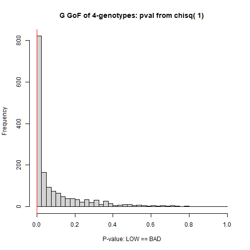

``` r
mean(pvals_ctm$pval4)
```

```
## [1] 0.1205191
```

``` r
mean(pvals_clean$pval4)
```

```
## [1] 0.09623471
```

``` r
## pvals by *locus*, for the dataset with contaminated *samples*, are substantially worse than in the clean dataset, on average.
```

``` r
ctm_bluefin_1 <- ctm_bluefin[, pvals_ctm$pval4 > 1e-15]
## so we will be _substantially_ more lenient on locus quality
## pvals_ctm_2 <- check6and4(ctm_bluefin, thresh_pchisq_6and4 = c(1e-4, 1e-6), show6 = FALSE)
dups <- find_duplicates(ctm_bluefin_1, max_diff_loci = 50)
```


``` r
## Note how cross-contaminated samples make duplicate-detection less clear - but we still
## have an OK air-gap at 50 different genos in this case
ctm_bluefin_2 <- ctm_bluefin_1[ -c( drop_dups_pairwise_equiv( dups[,2:3])),]

ilglk <- ilglk_geno(ctm_bluefin_2)
abline(v = -1550) ## put our cutoff here
```


``` r
ctm_bluefin_3 <- ctm_bluefin_2[ilglk > -1550,]
ilglk <- ilglk_geno(ctm_bluefin_3)     
```


``` r
# Not great... the issue is not so much outliers, but general mis-fit

ctm_bluefin_4 <- kin_power(ctm_bluefin_3, k = 0.5) 
## ... important but boring calculation - just run it

## kinfinding
hsps <- find_HSPs(ctm_bluefin_4, keep_thresh = -10)
```

```
## Returning just the 541 pairs with the highest PLOD scores; increase 'limit_pairs' to get more
```

``` r
histoPLOD( hsps, log=TRUE)
```


``` r
## Note the large additional bump around PLOD = 0, and lack 
## of air-gap between HSPs and POPs/FSPs.
histoPLOD( hsps, log=FALSE, lb = -5, fullsib_cut = 100)
```

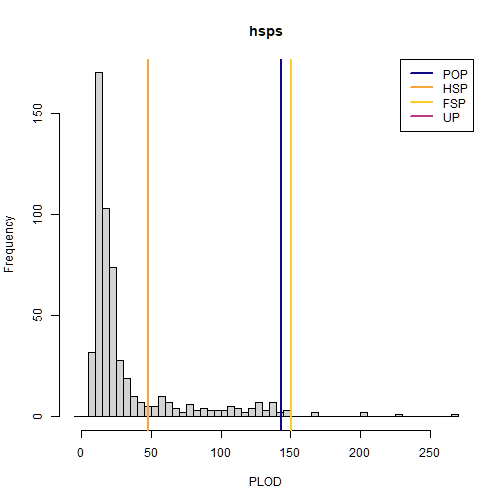

``` r
## Also notice a few pairs with suspiciously-high PLODs

## find and remove cross-contaminated samples:
## cross-contaminated samples are clear outliers
hetzrich <- hetzminoo_fancy(ctm_bluefin_4, "rich")
```


``` r
## cross-contaminated samples are almost as clear on the degradation variant:
hetzpoor <- hetzminoo_fancy(ctm_bluefin_4, "poor")
```


``` r
ctm_bluefin_4 <- ctm_bluefin_4[hetzrich < 0.27,] 

## skip removing the outlying hetzrich scores
hetzpoor <- hetzminoo_fancy(ctm_bluefin_4, "poor") ## Now we only have low outliers in hetzpoor!
```


``` r
ctm_bluefin_5 <- ctm_bluefin_4[hetzpoor > 0.18,] ## skip removing the bad ones

hsps <- find_HSPs(ctm_bluefin_5, keep_thresh = -10)
histoPLOD( hsps, log=TRUE) ## the PLOD bump around zero has gone
```


``` r
## ... and there are no more samples with suspiciously high PLODs
histoPLOD( hsps, log=FALSE, lb = -5, fullsib_cut = 100)
```


